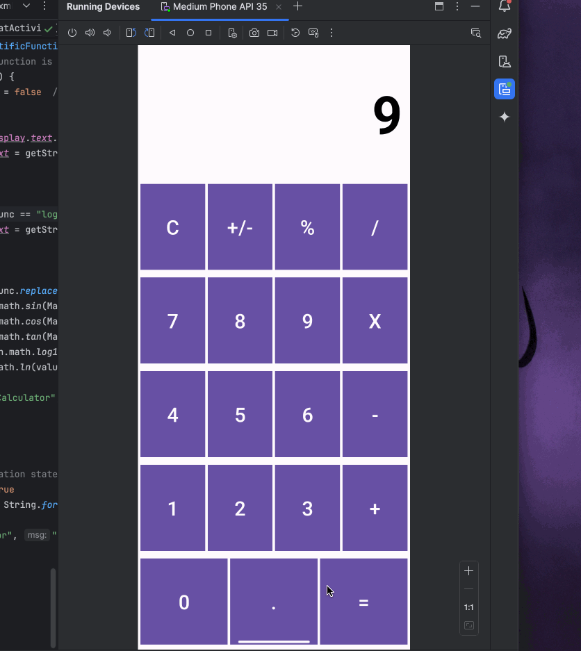

# Calculator

\# Project 2
This is a basic calculator application designed for Android using Kotlin and XML.
It emulates the functionality of a typical smartphone calculator, enabling users to effortlessly perform fundamental arithmetic calculations.

## **Features**  

The following **core functionalities** have been implemented:  

* A fully functional calculator layout with buttons for digits, arithmetic operations, and special functions.  
* Users can perform addition, subtraction, multiplication, and division.  
* Users can reset the calculator using the `C` button.  
* Users can toggle the sign of a number with the `+/-` button.  
* Users can compute percentages using the `%` button.  
* Users see real-time updates of their input in the top `TextView`.  
* Decimal numbers are supported via the `.` button.  
* Users can enter continuous calculations without needing to press `=` after each operation.
* Users can perform sin, cos, tan, log10, and ln scientific calculations.

### **Additional Enhancements:**  

* Full Persistence IO on Screen Rotation : Users will have retained input and results when the screen rotates on every orientations.
* Every button press is logged in LogCat for debugging and tracking.
* Preventing Multiple Decimal Points
* Enhanced UI and proper error-handling with Scientific Buttons in Landscape Mode

## **Demo Walkthrough**  

Below is a walkthrough demonstrating the app’s functionality:  

  

## Notes

1. Ensuring consistent number formatting → Used String.format("%.6f", result) instead of toString().
2. Handling invalid scientific calculations → Prevented operations like log10(0), ln(-5), and division by zero.
3. Preventing multiple decimals → Blocked multiple . entries in the same number.
4. Losing input on screen rotation → Used onSaveInstanceState() to store and restore input.

## **License**
© 2025 Gokul Kaarthick Shanmugam

Licensed under the Apache License, Version 2.0 (the "License");  
you may not use this file except in compliance with the License.  
You may obtain a copy of the License at:  

    http://www.apache.org/licenses/LICENSE-2.0  

Unless required by applicable law or agreed to in writing, software  
distributed under the License is provided "AS IS", WITHOUT WARRANTIES  
OR CONDITIONS OF ANY KIND, either express or implied.  
See the License for the specific language governing permissions  
and limitations under the License.  
